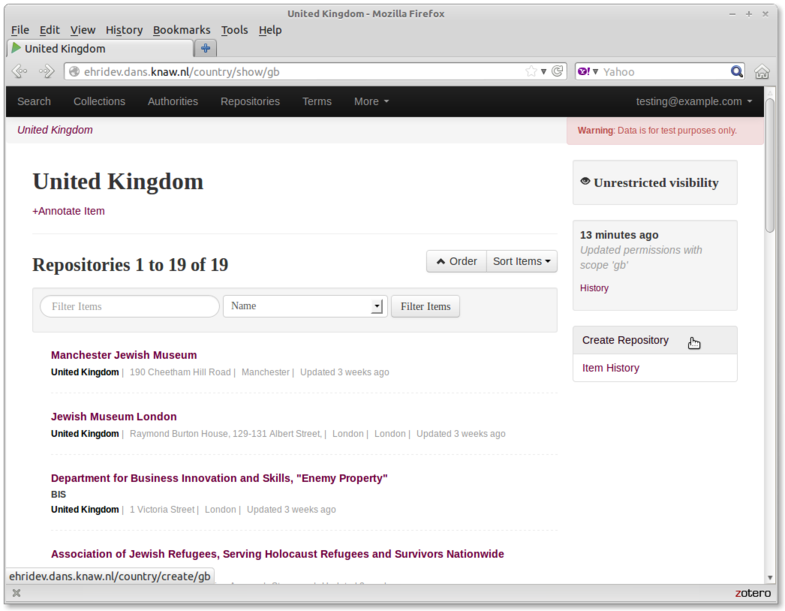
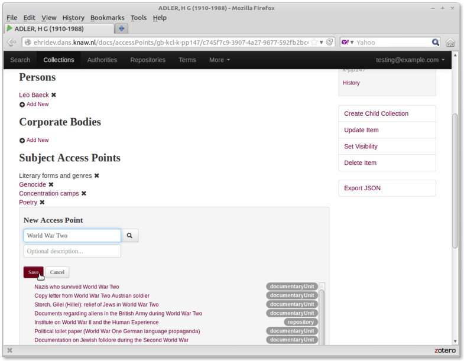

# EHRI Admin Tutorial - part 1

#### Part 2 - Create a new repository and add an archival unit

In the next part of this tutorial, we are going to create a new repository and add to it one archival collection. To create a repository, we first need to locate the country it resides in. This is because repositories "belong" to countries (in the database at least.)

We can search for the country we want (the UK) under the "More... -> Countries" menu.

Find the UK via the search function and select it.

Next, from within the UK country page, click the "Create Repository" button on the right hand side.

Fill out the relevant fields, based on the ISDIAH standard.  *Note*: the 'identifier' value will be pre-filled and should should leave it as-is.  Then, click the "Create Repository" button at the bottom.

When the new repository has been created we'll end up on its home page. Because collections are "held by" repositories, we can create a new collection by clicking the "Create New Collection" button on the right hand side.

Just like for the repository, fill out the collection's ISAD(G) fields. You can copy them from [here](http://www.aim25.ac.uk/cgi-bin/vcdf/detail?coll_id=8039&inst_id=6&nv1=search&nv2=). Then click "Create Collection":

Once we've filled out the basic values, we're going to add some access points. These are not part of the main form because the functionality is slightly more complex. Access points can either be "just text" or an actual link to another "thing" on the system (i.e. an authority file or a subject term.)  Once the item has been created, go to the "Actions" menu on its description page and click "Manage Access Points".

To add the creator of the item, click "Add New" under the creator section. Start typing the name of the creator (in this case "Adler"). Notice that items that match that name appear in a list below. If one of them looks like what we want, click it to select. In this case ignore the documentaryUnit called ADLER... and select the "Hans G. Adler" historical agent (which means "Authority file").

Finally, to create the access point and the link to the authority file, click the "Save" button.

Repeat the process for other access points. If there is no matching item on the system, just type its name in the text box and click "Save".

